## JavaScript 1일차 학습

### 목차

> 1. JavaScript로 요소 조작하기
> 2. JavaScript 데이터표시 방법
> 3. JavaScript 키워드
> 4. JavaScript 변수
---

### 1. JavaScript로 요소 조작하기

#### HTML 요소 조작하기

- JavaScript 의 수많은 메서드중 HTML 을 조작하는 대표적인 메서드는 `getElementById()` 이다.
- 아래 코드는 ID값이 'demo' 인 요소를 찾아 **요소컨텐츠(innerHTML)을 다른 문자열로 변경**하는 코드이다.
    - `document.getElementById('demo').innerHTML = 'Hello JavaScript';`
- 버튼을 눌렀을때 `<p>` 태그 텍스트가 변경되는 코드이다.
  ```html
  <!doctype html>
  <html lang="en">
  <head>
      <meta charset="UTF-8">
      <meta name="viewport" content="width=device-width, user-scalable=no, initial-scale=1.0, maximum-scale=1.0, minimum-scale=1.0">
      <meta http-equiv="X-UA-Compatible" content="ie=edge">
      <title>HTML 요소 수정</title>
  </head>
  <body>
  <h2>What Can JavaScript Do?</h2>
  <p id="demo">JavaScript can change HTML content.</p>
  <button type="button" onclick="document.getElementById('demo').innerHTML = 'Hello JavaScript!'">Click Me!</button>
  </body>
  </html>
  ```
  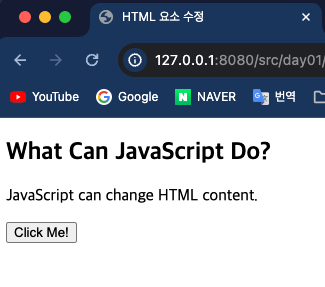 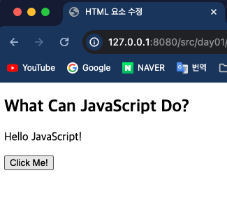

#### CSS 조작하기

- CSS 스타일을 적용시킬 HTML 요소에 접근하여 `.style` 을통해 다양한 속성을 지정할 수 있다.
  ```html
  <!doctype html>
  <html lang="en">
  <head>
      <meta charset="UTF-8">
      <meta name="viewport" content="width=device-width, user-scalable=no, initial-scale=1.0, maximum-scale=1.0, minimum-scale=1.0">
      <meta http-equiv="X-UA-Compatible" content="ie=edge">
      <title>CSS 요소 수정</title>
  <body>
  <h2>What Can JavaScript Do?</h2>
  <p id="demo">JavaScript can change the style of an HTML element.</p>
  <button type="button" onclick="document.getElementById('demo').style.fontSize='35px'">Click Me!</button>
  </body>
  </html>
  ```
  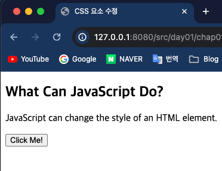 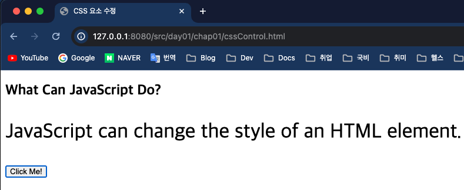

#### JavaScript 파일의 위치

> HTML 에서는 `<script></script>` 태그 사이에 JavaScript 코드가 삽입된다.

- JavaScript 코드는 `<head>` 태그 안이나 `<body>` 태그 안에 작성할 수 있다.
- 아래 코드는 사용자가 버튼을 클릭했을 때 후속동작을 `myFunction()` 에 정의하고 `onclick` 옵션을 통해 버튼클릭 이벤트에 연결하였다.
  ```html
  <!doctype html>
  <html lang="en">
  <head>
      <meta charset="UTF-8">
      <meta name="viewport" content="width=device-width, user-scalable=no, initial-scale=1.0, maximum-scale=1.0, minimum-scale=1.0">
      <meta http-equiv="X-UA-Compatible" content="ie=edge">
      <title>Head 안에 들어올 때</title>
      <script>
          function myFunction() {
              document.getElementById("demo").innerHTML = "Paragraph changed.";
          }
      </script>
  </head>
  <body>
  <h2>Demo JavaScript in Head</h2>
  
  <p id="demo">A Paragraph</p>
  <button type="button" onclick="myFunction()">Try it</button>
  </body>
  </html>
  ```
  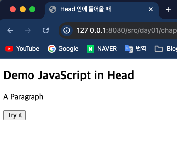 
- 아래 코드는 <body> 태그 안에 JavaScript 가 들어온 예제이고 위 예제와 똑같은 동작을 한다.
  ```html
  <!doctype html>
  <html lang="en">
  <head>
      <meta charset="UTF-8">
      <meta name="viewport" content="width=device-width, user-scalable=no, initial-scale=1.0, maximum-scale=1.0, minimum-scale=1.0">
      <meta http-equiv="X-UA-Compatible" content="ie=edge">
      <title>Body 안에 들어올 때</title>
  </head>
  <body>
  <h2>Demo JavaScript in Body</h2>
  
  <p id="demo">A Paragraph</p>
  
  <button type="button" onclick="myFunction()">Try it</button>
  
  <script>
      function myFunction() {
          document.getElementById("demo").innerHTML = "Paragraph changed.";
      }
  </script>
  </body>
  </html>
  ```
  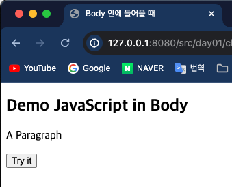 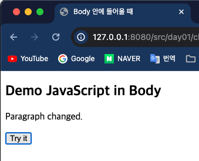
- 외부에 JavaScript 코드가 있을 때는 다음과 같이 정의한다.
    - `<script src="경로"></script>`
- JavaScript 코드를 외부에 두었을 때 다음과 같은 장점이 있다.
    1. HTML 코드와의 분리
    2. HTML 과 JavaScript 를 더 쉽게 읽고 유지보수 가능
    3. 캐시된 JavaScript 파일은 페이지 로드 속도를 높일 수 있다.

---

### 2. JavaScript 데이터표시 방법

- JavaScript 는 다양한 방법으로 데이터를 표시한다.
    - `innerHTML` : HTML 요소에 데이터 표시
    - `documnet.write()` : HTML 데이터 표시
    - `window.alert()` : 알림창에 데이터 표시
    - `console.log()` : 웹 브라우저 콘솔(개발자모드->console) 에 데이터 표시

#### innerHTML

- HTML 요소에 접근하기 위해서는 document.getElementById(id) 메서드를 사용하면 된다.
- HTML 요소 ID값을 통해 접근하는 것이다.
  ```html
  <!doctype html>
  <html lang="en">
  <head>
      <meta charset="UTF-8">
      <meta name="viewport" content="width=device-width, user-scalable=no, initial-scale=1.0, maximum-scale=1.0, minimum-scale=1.0">
      <meta http-equiv="X-UA-Compatible" content="ie=edge">
      <title>Inner HTML</title>
  </head>
  <body>
  <h1>My First Web Page</h1>
  <p>My First Paragraph</p>
  <p id="demo"></p>
  
  <script>
      document.getElementById("demo").innerHTML = 5 + 6;
  </script>
  </body>
  </html>
  ```
  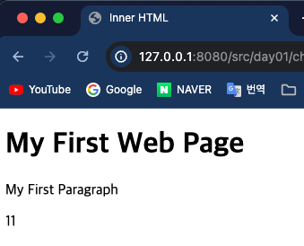

#### document.write()

- 보통 테스트 목적으로 `document.write()` 를 많이 사용한다.
  ```html
  <!doctype html>
  <html lang="en">
  <head>
      <meta charset="UTF-8">
      <meta name="viewport" content="width=device-width, user-scalable=no, initial-scale=1.0, maximum-scale=1.0, minimum-scale=1.0">
      <meta http-equiv="X-UA-Compatible" content="ie=edge">
      <title>Document.write()</title>
  </head>
  <body>
  <h2>My First Web Page</h2>
  <p>My first paragraph.</p>
  
  <p>Never call document.write after the document has finished loading.
      It will overwrite the whole document.</p>
  
  <script>
      document.write(5 + 6);
  </script>
  </body>
  </html>
  ```
  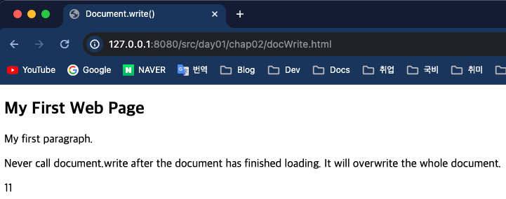
- 주의점 ! ***HTML 문서가 로드된 후 document.write()를 사용하면 기존 HTML 이 모두 삭제***된다.
  ```html
  <!doctype html>
  <html lang="en">
  <head>
    <meta charset="UTF-8">
    <meta name="viewport" content="width=device-width, user-scalable=no, initial-scale=1.0, maximum-scale=1.0, minimum-scale=1.0">
    <meta http-equiv="X-UA-Compatible" content="ie=edge">
    <title>Warning Document Write</title>
  </head>
  <body>
  <h2>My First Web Page</h2>
  <p>My first paragraph.</p>
  
  <button type="button" onclick="document.write(5 + 6)">Try it</button>
  </body>
  </html>
  ```
  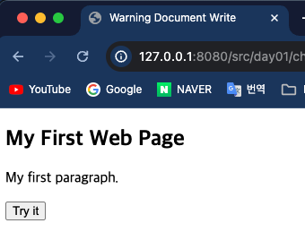 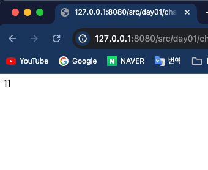

#### window.alert()

- 알림창을 사용하여 알림창위에 데이터를 표시할 수 있다.
    - `window` 를 생략하고 `alert(5+6);` 으로 선언 가능하다.
  ```html
  <!doctype html>
  <html lang="en">
  <head>
      <meta charset="UTF-8">
      <meta name="viewport" content="width=device-width, user-scalable=no, initial-scale=1.0, maximum-scale=1.0, minimum-scale=1.0">
      <meta http-equiv="X-UA-Compatible" content="ie=edge">
      <title>Alert</title>
  </head>
  <body>
  <h1>My First Web Page</h1>
  <p>My first paragraph.</p>
  
  <script>
      window.alert(5 + 6);
  </script>
  </body>
  </html>
  ```
  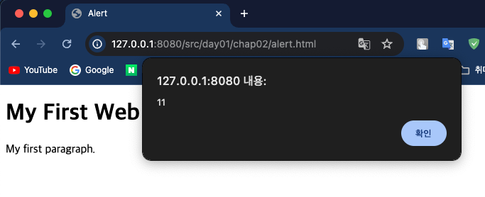

#### console.log()

- **디버깅**을 위해 브라우저에서 `console.log()` 메서드를 호출하여 데이터를 표시한다.
  ```html
  <!doctype html>
  <html lang="en">
  <head>
      <meta charset="UTF-8">
      <meta name="viewport" content="width=device-width, user-scalable=no, initial-scale=1.0, maximum-scale=1.0, minimum-scale=1.0">
      <meta http-equiv="X-UA-Compatible" content="ie=edge">
      <title>Console.log()</title>
  </head>
  <body>
  <script>
      console.log(5 + 6);
  </script>
  </body>
  </html>
  ```
  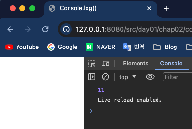

---

### 3. JavaScript 키워드

- JavaScript 에서 자주사용하는 키워드는 아래와 같다.

| Keyword         | Description                          |
|-----------------|--------------------------------------|
| `var`           | 변수를 선언하는 가장 기본적인 키워드, 스코프를 구분하지 않는다. |
| `let`           | 지역 변수 선언                             |
| `const`         | 상수 변수 선언                             |
| `if` , `switch` | 조건문                                  |
| `for`           | 반복문                                  |
| `function`      | 함수 선언                                |
| `return`        | 함수 종료                                |
| `try`           | 예외처리                                 |

---
### 4. JavaScript 변수
> JavaScript 에서 변수 선언 방법은 4가지이다.
> 1. `Automatically`(자동)
> 2. `var`
> 3. `let`
> 4. `const`

#### 참고사항
- `var` 키워드는 1995년부터 2015년까지 모든 JS 코드에서 사용됐다.
- 2015년부터 `let` 과 `const` 가 추가되었다.
- 즉, `var` 키워드는 **이전 브라우저용으로 작성된 코드에서만 사용**해야 한다.
  - 그 외에도 스코프 문제때문이라도 `let` 과 `const` 를 사용하는게 좋다.


