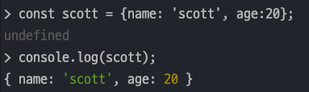
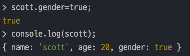
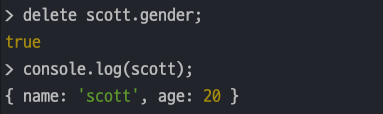
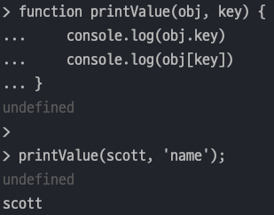

## JavaScript 2일차 학습

### 목차

1. callback 이란?
2. 클래스란?
3. Object 란?
4. dom 이란?

---

### 1. callback 이란?

> `JavaScript` 에서 콜백함수란 함수의 파라미터로서 다른 함수에 전달하고 함수 내부에서 그 함수를 호출하는 것을 의미한다.

- 아래 코드와 같이 ₩ 함수는 다른 함수를 파라미터로 받아서 내부에서 그 함수를 호출한다.
    ```javascript
        function print(callback){
            callback();
        }
    ```
- 이것을 콜백이라 한다.

#### 콜백 함수가 필요한 이유

- `JavaScrdipt` 는 코드를 위에서 아래로 순차적으로 실행한다.
- 하지만 코드는 다른 행위가 일어난 뒤에 실행되는 경우도 있고 순차적으로 실행되지 않을 때가 있다.
- 이런 걸 `비동기 프로그래밍`이라고 한다.
- 콜백은 **Task(작업)가 끝나기 전에 함수가 실행되는 것을 보장**한다.
- 즉, **콜백은 비동기 JavaScript 코드를 작성할 수 있도록 해준다**.

---

### 2. 클래스란?

> 클래스는 객체(Object)와 관련이 있다. 클래스는 객체를 생성하기 위한 템플릿이다.

#### 클래스 기본구조

- **생성자**, **필드**, **메서드**로 이루어져 있다.
- **생성자**는 `constructor()` 로 선언하고 Java와 같이 **생성자 초기화 시 파라미터를 받을 수 있다.**
- **필드**는 **생성자 내부에서 초기화**를 해준다.
- **메서드**는 일반적인 함수정의와 똑같다.
  ```javascript
  class User{
      constructor(username, age){
          this.username = username;
          this.age = age;
      }
      info(){
          console.log(`저의 이름은 ${this.name}이고, 나이는 ${this.age} 살 입니다.`);
      }
  }
  ```

#### Getter , Setter

- `get` , `set` 키워드를 통해 메서드를 생성하면 된다.
  ```javascript
  class User {
      constructor(firstName, lastName, age) {
          this.firstName = firstName;
          this.lastName = lastName;
          this.age = age;
      }
  
      get age() {
          return this.age;
      }
  
      set age(age) {
          this.age = age;
      }
  }
  ```

#### 접근제어자

- 접근제어자는 `private` 과 `public` 이 있다.
- `private` 으로 선언할 필드에 `#` 을 붙혀준다. 붙히지 않으면 기본값은 `public` 이다.
  ```javascript
  class Exper {
      publicField = 2 // #를 안붙히면 public 으로 설정
      #privateField = 0; // # 을 붙히면 private 으로 설정
  }
  ```

#### static

- `static` 키워드를 붙혀주면 된다.
- `static` 으로 선언한 필드는 `클래스명.필드명` 으로 호출한다.
  ```javascript
  class Article {
      static publisher = "Cristiano Ronaldo";
  
      constructor(articleNumber) {
          this.articleNumber = articleNumber;
      }
  
      static printPublisher() {
          console.log(Article.publisher);
      }
  }
  
  const article1 = new Article("7777");
  
  console.log(Article.publisher);
  ```

#### 클래스 상속

- 상속은 `extends` 를 통해 상속을 받는다. 개념은 Java 와 똑같다.
  ```javascript
  class Shape {
      constructor(width, height, color) {
          this.width = width;
          this.height = height;
          this.color = color;
      }
  
      draw() {
          console.log(`drawing ${this.color} color of`);
      }
  
      getArea() {
          return this.width * this.height;
      }
  };
  
  class Rectangle extends Shape {
  };
  
  const rect = new Rectangle(20, 20, 'Red');
  
  rect.draw();
  ```

---

### 3. Object 란?

> `Object` 는 `{}` 안에 `key:value` 형식으로 데이터를 넣는다.

#### Object 선언방식

1. `const obj1 = {};`
2. `const obj2 = new Object();`

#### 클래스 없이 객체 생성

- `Object` 를 사용하면 클래스가 없어도 객체를 생성할 수 있다.
  ```javascript
  const scott = {name: 'scott', age: 20};
  console.log(scott);
  ```
  

#### Object 내장함수

- 값을 추가할 때는 `object.key=value` 로 정의와 동시에 생성이 가능하다.

  
- 값을 삭제할 때는 `delete` 키워드를 사용한다.
  ```javascript
  delete scott.gender;
  console.log(scott);
  ```
  

#### JavaScript 동적실행

- 아래 코드를 실행하면 첫번째 콘솔출력값은 나오지 않는다.
  ```javascript
    function printValue(obj, key) {
        console.log(obj.key);
        console.log(obj[key]);
    }
    
    printValue(scott, 'name');
  ```
  
- 왜냐하면 첫줄에 `console.log(obj.key)` 는 obj 에서 'key'를 라는 key 를 찾는다.
- 하지만 `console.log(obj[key])` 는 obj 에 입력받은 'key' 라는 key 값을 찾는다.

---

### dom 이란?

> DOM(The Document Object Model)은 HTML , XML 문서의 프로그래밍 인터페이스이다.<br>
> DOM은 프로그래밍 언어가 DOM 구조에 접근할 수 있는 방법을 제공해준다.

- HTML 문서 전체에 적용 : `document.getElementByTagName(name);`
- 특정요소 내 적용 : `element.getElementsByTagName(name);`
- 반환값은 태그 이름에 해당하는 모든 요소를 `HTMLCollection` 객체로 반환
    
- `HTMLCollection` 객체를 반환하는 메서드
  1. `getElementByTagName()`
      - 태그이름과 일치하는 모든 요소를 찾아서 HTMLCollection 객체로 변환
  2. `getElementByClassName()`
      - 클래스명과 일치하는 모든 요소를 찾아서 HTMLCollection 객체로 변환
  3. `getElementById()`
      - 아이디명 일치하는 모든 요소를 찾아서 HTMLCollection 객체로 변환

- `querySelector()` : CSS 선택자와 일치하는 첫 번째 요소의 객체를 반환
- `querySelectorAll()` : CSS 선택자와 일치하는 모든 요소 객체를 반환