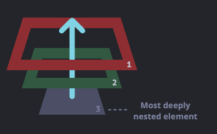

## JavaScript 4일차 학습

### 목차

> 1. HTML DOM 이란?
> 2. addEventListener() 란?(버블링과 캡쳐링)
> 3. 예외처리
---
### 1. HTML DOM 이란?

> HTML DOM(Document Object Model)은 JavaScript 를 HTML의 요소에 적용하기 위한 인터페이스이다.

- `<html>` 의 DOM 모델은 객체 트리로 구성된다.
    - `Element` 는 각 태그를 뜻한다.
    - `Attribute` 는 속성을 뜻한다.
    - `style` 은 CSS 를 뜻한다.
      
      
- 예를 들어 `document.getElementsByTagName("tagname");` 이라는 명령어를 해석하면 아래와 같다.
    - `document` : DOM 의 최상위 루트
    - `getElementsByTagName(tagname)` : Element 중에 모든 tagname 을 찾아서 `HTMLCollection` 으로 반환한다.

#### HTMLCollection

- HTMLCollection 은 **HTML 요소의 배열과 유사한 컬렉션**이다.
- 다양한 속성과 메서드를 가진다.
    - `length` : HTMLCollection의 요소 수를 반환
    - `item()` : 지정된 인덱스의 요소를 반환
    - `namedItem()` : 지정된 ID를 가진 요소를 반환
  > _HTMLCollection 은 배열과 유사하지만 배열은 아니다 !_

#### querySelector()

- CSS 선택자와 일치하는 **첫 번째 요소를 반환**합니다.
- 첫 번째 요소가 아닌 모든 요소를 반환 할려면 `querySelectorAll()` 를 사용하면 된다.
- `querySelectorAll()` 은 NodeList 를 반환하는데 NodeList 는 HTMLCollection 과 유사하지만 **정적인 컬렉션**이다.

---

### 2. addEventListener() 란?(버블링과 캡쳐링)

- `addEventListener()` 메서드는 이벤트 핸들러를 요소에 연결해준다.

#### 기본구조

- `element.addEventListener(event, function, useCapture);`

  | 매개변수명        | 설명                                                                                                    |
  |--------------|-------------------------------------------------------------------------------------------------------|
  | `event`      | 필수 속성으로 DOM Events 가 들어간다([이벤트 목록](https://www.w3schools.com/jsref/met_element_addeventlistener.asp)) |
  | `function`   | 필수 속성으로 이벤트 발생 시 실행되는 함수이다.                                                                           |
  | `useCapture` | 옵션속성이고 기본값이 false 이다.(false: 버블링 단계에서 실행, true:캡쳐링 단계에서 실행)                                           |

#### 버블링과 캡쳐링
- `버블링(bubbling)` : 한 요소에 이벤트가 발생하면, 이 요소에 할당된 핸들러가 동작하고, 이어서 부모 요소의 핸들러가 동작하는 단계
  - 예를 들어 `<form>` > `<div>` > `<p>` 구조 일때 각각 이벤트가 있다.
  - 이 때 <p> 태그에 이벤트를 발생시키면 div , form 태그에 이벤트가 순차적으로 거슬러 올라가면 발생한다.
  - 마치 물속 거품(bubble)과 닮아서 버블링이라 한다.
    
    
  > 거의 모든 Event 는 버블링(bubbling)이 된다. 몇몇 이벤트를 제외하곤 대부분 버블링이다.
- `캡쳐링(capturing)` : 캡쳐링은 실제 코드에서 자주 쓰이지는 않지만 종종 유용한 경우가 있다.
- 우선 표준 DOM 이벤트에서 정의한 이벤트 흐름은 3가지 단계가 있다.
  1. `캡쳐링 단계` : 이벤트가 **하위 요소로 전파**되는 단계
  2. `타깃 단계` : 이벤트가 **실제 타깃 요소에 전달**되는 단계
  3. `버블링 단계` : 입덴트가 **상위 요소로 전파**되는 단계
- 아래 예시는 테이블 안에 `<td>` 를 클릭하면 어떻게 이벤트가 흐르는지 그린것이다.
    
    
- `<td>` 태그 클릭시 이벤트가 최상위 조상에서 시작해 아래로 전파되고(캡쳐링단계), 이벤트가 타깃 요소에 도착해 실행된 후(타깃 단계), 다시 위로 전파된다(버블링 단계)
- 이런 과정을 통해 요소에 할당된 이벤트 핸들러가 호출된다.
  > [참고자료](https://ko.javascript.info/bubbling-and-capturing)

#### 예제

- 아래 코드는 `element` 에 `click` 이벤트를 연결하여 해당 `function` 을 실행하는 로직이다.
  ```javascript
  element.addEventListener("click", function () {
      alert("Hello World!");
  });
  ```
---
### 3. 예외처리
> JavaScript 에서 예외처리는 `try` , `catch` , `finally` , `throw` 로 이루어진다.

- `try` : 실행할 코드 블록을 정의
- `catch` : 오류를 처리하기 위한 코드 블록
- `finally` : try-catch와 관계없이 반드시 실행하는 코드 블록
- `throw` : 사용자 정의 오류를 정의

#### try-catch 구문
- try 와 catch 는 한쌍으로 이루어진다.
  ```javascript
  try {
      // Block of code to try
  }catch(err){
      // Block of code to handle errors
  }
  ```
#### throw 문
- throw 키워드를 사용하면 사용자 정의 오류를 생성할 수 있다.
  ```javascript
  throw "Too bit"; // throw a text
  throw 500; // throw a number
  ```
#### Error Object
- `JavaScript` 에서는 오류를 발생할 때 오류 정보를 제공하는 오류 객체가 내장되어 있다.
- Error Object 의 속성은 다음과 같다.

  |속성명|설명|
  |---|---|
  |`name`|오류명을 설정하거나 반환|
  |`message`|오류 메시지를 설정하거나 반환|

- `Error Name` 에 들어오는 표준 속성은 다음과 같다.

  |오류명| 설명                                                     |
  |---|--------------------------------------------------------|
  |`EvalError`| `eval()`함수에서 오류가 발생할 때(최신 JS 에서는 없음, `SystaxError` 사용) |
  |`RangeError`| 숫자가 범위를 벗어날 때                                          |
  |`ReferenceError`| 잘못된 참조                                                 |
  |`SyntaxError`| 문법오류                                                   |
  |`TypeError`| 타입이 안맞을 때                                              |
  |`URIError`| `encodeURI()` 에서 오류 발생 시                                 |

- 비표준 오류 객체 속성은 다음과 같다.(Mozlla 와 Microsoft 에서는 계속 사용)
  - `fileName(Mozilla)`
  - `lineNumber(Mozilla)`
  - `columnNumber(Mozilla)`
  - `stack(Mozilla)`
  - `description(Microsoft)`
  - `number(Microsoft)`
- 
  