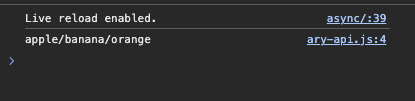
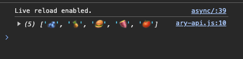
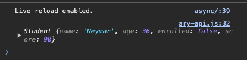
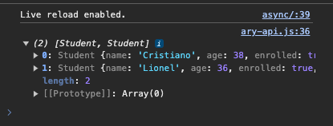
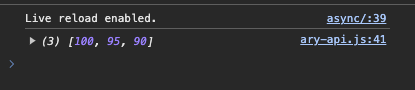

## JavaScript 5일차 학습

### 목차
> 1. 웹기술 나열
> 2. JSON 학습
> 3. 동기/비동기
> 4. Array API
---
### 1. 웹기술 나열
- 기본적으로 `브라우저(Client)` 와 `서버(Server)`가 통신을 할 때는 ***인터넷 연결이 되어 있는 상태에서 HTTP / HTTPS 프로토콜로 통신***을 한다.
- 이 때 웹에서 **동적으로 데이터를 주고 받는 기술**이 있는데, 이를 `Ajax(Asynchronus Javascript And XML)` 이라 한다.
- 이 때 전송데이터 형식은 `JSON(JavaScript Object Notation)` 을 사용한다.
- `JSON` 은 `{key : value}` 형식으로 되어 있다.
---
### 2. JSON 학습
- `JSON`을 사용하기 이전에는 XML 을 사용하였다. 하지만 **XML 은 데이터가 많아지면 데이터크기가 많이 커졌다.**
- 직원 3명의 데이터를 가지는 배열을 JSON 과 XML 을 비교해보자
    ```json
    {"employees":[
      { "firstName":"John", "lastName":"Doe" },
      { "firstName":"Anna", "lastName":"Smith" },
      { "firstName":"Peter", "lastName":"Jones" }
    ]}
    ```
    ```xml
    <employees>
      <employee>
        <firstName>John</firstName> <lastName>Doe</lastName>
      </employee>
      <employee>
        <firstName>Anna</firstName> <lastName>Smith</lastName>
      </employee>
      <employee>
        <firstName>Peter</firstName> <lastName>Jones</lastName>
      </employee>
    </employees>
    ```
- `JSON` 은 ***경량 데이터 교환 형식***이다.

#### JSON 사용이유
- JSON 형식은 JavaScript 객체를 생성하는 코드와 문법상 비슷하다.
- 이 때문에 **JavaScript 프로그램은 JSON 데이터를 JavaScript 객체로 쉽게 변환**할 수 있다.
- *형식이 텍스트 전용이므로 컴퓨터간 쉽게 전송되며 모든 프로그래밍 언어에서 사용 가능*하다.

#### parse() , stringify()
- `parse()` : JSON 문자열을 JavaScirpt 객체로 변환
- `stringify()` : JavaScript 객체를 JSON 문자열로 변환

#### JSON Value 로 올 수 있는 것
- `String` , `number` , `object` , `array` , `boolean` , `null`
- `function` , `date` , `undefined` 는 올 수 없다.


---
### 3. 동기/비동기
> JS 에서 비동기란 다른 함수와 병렬로 실행되는 함수를 비동기라고 한다. 동기는 순서대로 실행된다.
#### 비동기(Asynchronous) 구현방법
1. `callback`
2. `promise`
   - 콜백함수 대신에 사용하는 비동기 오브젝트
   - `producer` 와 `consumer` 를 **연결해주는 특별한 JavaScript 객체**
   - `promise` 를 **사용해서 비동기 실행 함수를 만들고** 실행 결과가 성공되면 `resolve(value)`를 호출하여 결과값을 `consumer` 에게 전달
   - 실행결과 실패 시 `reject(error)`를 호출하여 에러 전달
   - 상태는 3가지가 있다.
     - `대기(pending)`
     - `이행(fulfilled)`
     - `거부(rejected)`
   - consumer 는 결과값을 받으면 then() 이라는 메서드를 사용하여 출력
3. async, await : promise 보다 훨씬 더 쉬운방법

#### async, await
> - `async` : 함수가 Promise 반환하도록 만든다.<br>
> - `await` : 함수가 Promise 기다리도록 만든다.

- async 함수
  - function 키워드 앞에 붙게되면 해당 함수는 항상 Promise 를 반환하게 된다.
    ```javascript
    async function f(){
        return 1;
    }
    
    f().then(alert);
    ```
- await 키워드는 반드시 async 함수 안에서만 동작한다.
- JavaScript 는 awiat 키워드를 만나면 프라미스가 처리될 때까지 기다린다.
```javascript
async function f() {
    let promise = new Promise((resolve, reject) =>{
        setTimeout(()=> resolve("완료!"),1000)
    });
    
    let result = await promise; // promise 가 끝날 때 까지 기다림
    
    alert(result);
}

f();
```
---
### 4. Array API
- Array(배열)과 관련된 API 는 많지만 자주 사용하는것만 정리하였다.

#### join()
- join() 은 배열 안 데이터들을 이어붙혀 string 으로 변환할 때 사용한다.
- 파라미터로는 이어붙힐 때 들어가는 문자열이 온다.
    ```javascript
    let fruits = ['apple', 'banana', 'orange'];
    let result = fruits.join('/');
    console.log(result);
    ```
  

#### split()
- 문자열을 자를 때 사용한다. 자르는 기준값이 파라미터로 온다.
    ```javascript
    let fruits = '🫐,🍍,🍔,🍠,🍅';
    let result = fruits.split(',');
    console.log(result);
    ```
  

#### find()
- 기준에 일치하는 처음 요소만 반환한다.
    ```javascript
    class Student {
        constructor(name, age, enrolled, score) {
            this.name = name;
            this.age = age;
            this.enrolled = enrolled;
            this.score = score;
        }
    }
    
    let studentList = [
        new Student("Cristiano", 38, true, 100),
        new Student("Lionel", 36, true, 95),
        new Student("Neymar", 36, false, 90)
    ];
    
    let result = studentList.find(function (student, index) {
        return student.score === 90;
    });
    console.log(result);
    ```
  

#### filter()
- find() 와 다르게 조건에 일치하는 모든 요소를 반환한다.
    ```javascript
    class Student {
        constructor(name, age, enrolled, score) {
            this.name = name;
            this.age = age;
            this.enrolled = enrolled;
            this.score = score;
        }
    }
    
    let studentList = [
        new Student("Cristiano", 38, true, 100),
        new Student("Lionel", 36, true, 95),
        new Student("Neymar", 36, false, 90)
    ];
    
    let result = studentList.filter(student=> student.enrolled);
    console.log(result);
    ```
  

#### map()
- 배열 내의 모든 요소에 각각 함수를 적용하거나 특별한 연산을 하여 새로운 배열로 반환한다.
    ```javascript
    class Student {
        constructor(name, age, enrolled, score) {
            this.name = name;
            this.age = age;
            this.enrolled = enrolled;
            this.score = score;
        }
    }
    
    let studentList = [
        new Student("Cristiano", 38, true, 100),
        new Student("Lionel", 36, true, 95),
        new Student("Neymar", 36, false, 90)
    ];
    let result = studentList.map(student => student.score);
    console.log(result);
    ```
  
